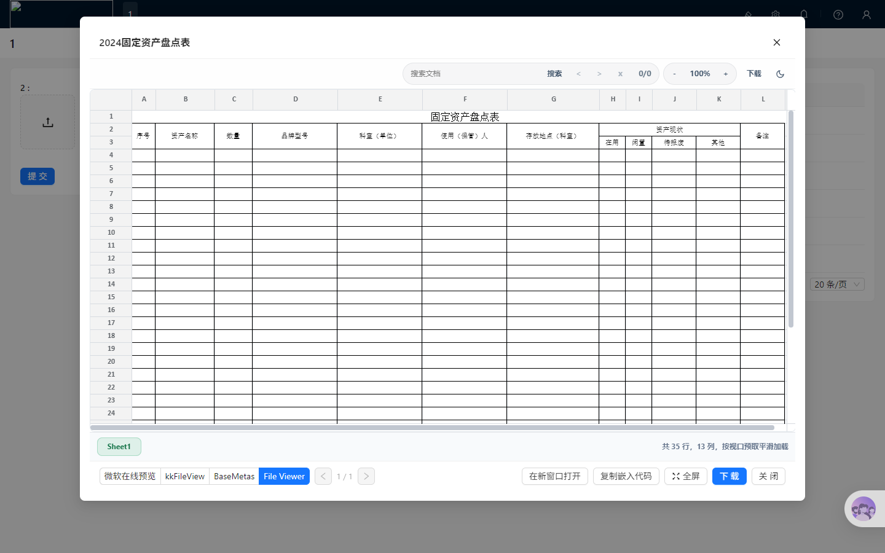
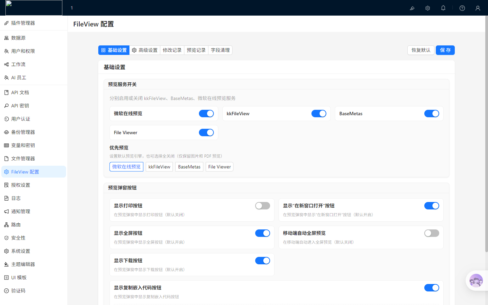
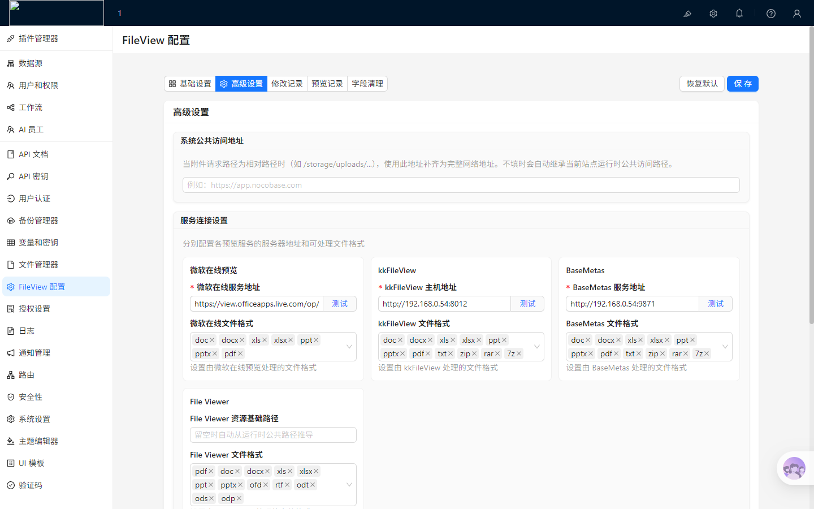
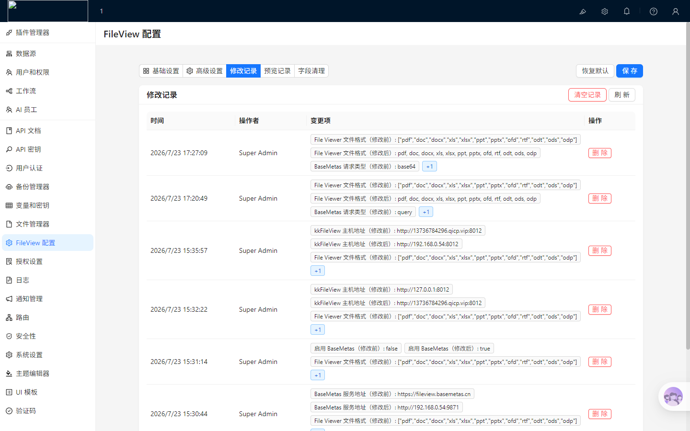
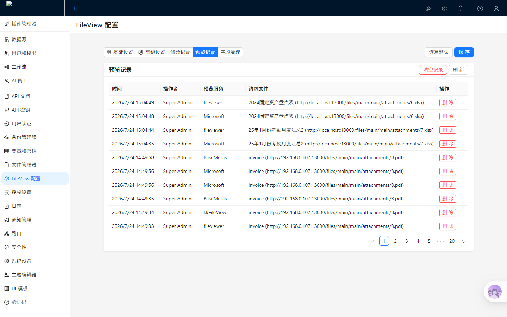
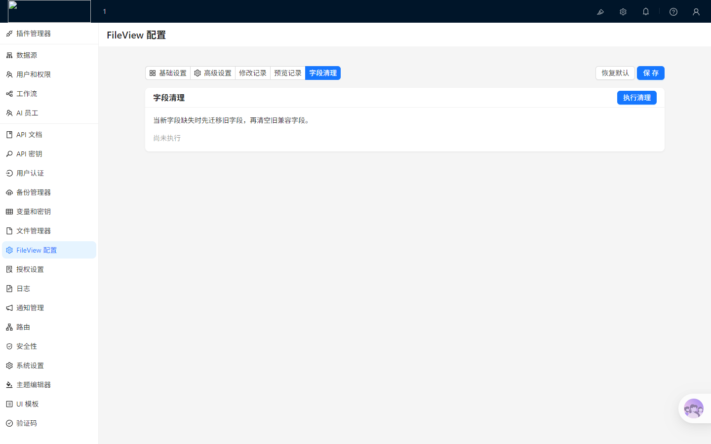

# @nocobase/plugin-file-previewer-kkfileview

[](https://github.com)
[](https://www.nocobase.com)
[](LICENSE)

高功能、多引擎的 NocoBase 文件预览插件，深度集成 **kkFileView**、**BaseMetas**、**Microsoft Online** 与本地离线 **File Viewer** 四大预览引擎。为 NocoBase 提供涵盖 Office 文档（Word/Excel/PPT）、PDF、CAD 图纸、3D 模型、音视频及压缩包的全方位在线与离线预览解决方案。

---

## 📸 界面与功能展示

### 1. 多引擎在线文件预览窗口
提供流畅沉浸式的文档预览弹窗，底部集成四大预览引擎一键无缝切换、多页翻页、打印、在新窗口打开、生成嵌入代码、全屏/缩小控制、文件下载及关闭等功能。



### 2. 全屏沉浸预览效果
进入全屏模式后隐去边缘干扰，右上角智能呈现悬浮“退出全屏/缩小”按钮，随鼠标悬停自动高亮，提供极致的大屏沉浸阅读体验。


### 3. 移动端 / 小屏响应式自适应
自动检测 iPhone、Android 手机和平板设备视口，智能开启移动端全屏布局与手势操控，优化控制栏按钮间距与触控体验。


### 4. 基础设置面板
支持灵活开启/关闭各项预览服务、设置系统默认优选预览引擎、配置全局与预览窗口水印，并可对打印、下载、新窗口打开及复制代码按钮进行开关与细粒度权限管控。



### 5. 高级设置面板
配置系统公共 Host 地址、各预览引擎的服务端 URL 地址与文件扩展名映射。支持服务连通性实时测试、一键离线资产提取及离线包快速下载。



### 6. 配置修改历史审计
完整记录每一次系统配置变更的时间、操作人、IP 及修改前后变更项对比，保障系统可追溯与可审计。



### 7. 预览调用日志与浏览统计追溯
提供完整的用户文件预览日志记录与浏览数量统计，清晰审计预览时间、文件名称、文件 URL、实际调用的预览服务引擎以及各文件的累计调阅频次。



### 8. 兼容字段平滑清理
提供平滑过渡字段迁移与一键清理功能，确保新旧插件版本升级后数据库结构干净且无缝兼容。



---

## ✨ 核心特性

- 🚀 **四合一多引擎无缝切换**：
  - **kkFileView**：支持私有部署的大型文档在线预览引擎（支持 Base64 / Query 参数加密）。
  - **BaseMetas**：支持 Office、CAD、OFD 等高性能预览引擎。
  - **Microsoft Online**：公有云极简部署的微软官方在线预览服务。
  - **File Viewer**：纯前端/本地离线预览引擎，完美适应网闸与隔离内网。
- 📊 **文件预览统计与调用日志追溯**：
  - 自动记录每次文件调用的预览时间、文件名称、文件 URL、操作用户及实际调用的预览引擎。
  - 支持文件浏览数量统计与日志追溯审计，方便系统管理员掌控文档调阅热度与合规分析。
- 🎨 **极致交互与细节优化**：
  - **标准大小按键与响应式控制栏**：底部操作栏使用标准中等尺寸按钮，兼顾移动端与桌面端的轻松点击体验。
  - **全屏沉浸预览与右上角悬浮缩小**：进入全屏模式后，右上角智能呈现悬浮“退出全屏/缩小”按钮，提供极佳的快捷操作体验。
  - **移动端自动全屏**：检测到移动设备时可自动开启全屏布局，极大提升手机和平板上的视图阅读体验。
- 🔄 **NocoBase 全版本无缝兼容**：
  - 完美向下兼容 **NocoBase 2.1.x** 与 **NocoBase 2.2.x** 所有版本。
  - 前后端内置兼容适配（包含 Client-V1/V2 双出口与 2.1.x `filterByTk` 动作更新补丁），无需修改任何底层代码。
- 🛡️ **动态安全水印机制**：
  - 支持全局水印遮罩与预览窗口嵌入水印。
  - 内置支持 `{{user.username}}`、`{{user.nickname}}`、`{{user.department}}`、`{{request.time}}` 等动态占位符变量。
- 📦 **嵌入代码与细粒度权限**：
  - 支持一键配置并生成 iframe 嵌入代码（支持自定义宽高、边框及全屏属性）。
  - 可按“仅管理员”、“普通用户”或“指定角色”精确控制“复制嵌入代码”按钮的可见度。
- 📦 **双版本打包与内网离线部署**：
  - 提供**轻量版**（~80KB，静态资源走 CDN）与**完整版**（~60MB，内置 170MB+ 离线静态资产）。
  - 设置后台支持一键从本地 node_modules 提取 File Viewer 离线资产，完全适应零外网的网闸隔离环境。

---

## 🛠️ NocoBase 版本兼容说明

本插件经过针对性的多版本适配与底层抽象，支持在以下 NocoBase 版本中无缝安装与使用：

| NocoBase 版本 | 兼容状态 | 适配说明 |
| :--- | :---: | :--- |
| **NocoBase 2.2.x 全系列** | 🟢 完全兼容 | 默认集成 Client-V2 现代前端架构与全新 APIClient。 |
| **NocoBase 2.1.x 全系列** (如 2.1.19) | 🟢 完全兼容 | 内置 Client-V1/V2 双出口与 2.1.x `filterByTk` 动作更新补丁，避免 `to do update action, filter or filterByTk is required` 报错。 |

> [!NOTE]
> 在 NocoBase 2.1.x 与 2.2.x 之间，已自动处理客户端应用 Hook 适配层与服务端 `update` 动作过滤条件（`filterByTk`）的前后端双重打补丁逻辑，用户无需任何额外特殊配置。

---

## ⚙️ 核心预览引擎对比

| 引擎 | 部署方式 | 推荐文件格式 | 跨域/网络要求 |
| :--- | :--- | :--- | :--- |
| **kkFileView** | 私有部署 Server | Doc/Docx, Xls/Xlsx, Ppt/Pptx, Pdf, Zip 等 | 需在配置中填写准确的 Server 地址（支持 Base64 参数模式） |
| **BaseMetas** | 私有部署 / 云服务 | Office 全系、CAD、OFD、PDF 等 | 支持 Query 参数模式与 Base64 编码数据传输 |
| **Microsoft Online** | 公有云在线服务 | Office (Docx, Xlsx, Pptx) | 仅需浏览器端访问外网，不支持内网隔离域名 |
| **File Viewer** | 本地离线 / 静态托管 | Office, PDF, 3D 模型, 音视频, 压缩包 | 支持完全物理隔离的纯内网环境（可一键下载本地离线包） |

---

## 📥 安装与开启

```bash
# 1. 添加入项目插件目录并启用
yarn nocobase pm add @nocobase/plugin-file-previewer-kkfileview
yarn nocobase pm enable @nocobase/plugin-file-previewer-kkfileview

# 2. 升级数据库配置表
yarn nocobase upgrade
```

---

## 📦 双版本打包与部署说明

为了兼顾“极致的包体积”与“纯内网离线部署需求”，本插件支持一键生成**双版本**发布包：

- **轻量版** (`plugin-file-previewer-kkfileview-x.y.z.tgz`，约 80KB)：默认不内置静态资源，运行时通过公共 CDN（unpkg）或自定义地址加载。
- **完整版** (`plugin-file-previewer-kkfileview-x.y.z-full.tgz`，约 60MB)：内置所有本地预览所需的静态资源，运行时默认加载本地静态路径，适合完全物理隔绝的内网/离线环境。

### 1. 一键双版本打包指令
在插件根目录下运行以下命令，系统将在 `storage/tar/@nocobase/` 目录下同时输出轻量版与完整版的 `.tgz` 压缩包：
```bash
npm run pack-all
# 或
yarn pack-all
```

### 2. 离线/内网环境下完整版部署
- **部署方式**：直接在内网 NocoBase 实例中安装并启用 **完整版 (`*-full.tgz`)** 的插件包。
- **零配置**：启动后，插件客户端会自动检测并加载随包附带的本地静态资源，无需手动配置静态文件服务器。

### 3. 离线/内网环境下轻量版部署（后台一键提取 / 自托管）
如果安装的是**轻量版**，但仍需在内网环境使用 `File Viewer` 离线服务：
1. 登录 NocoBase 后台，进入 **FileView 文件预览配置 -> 高级设置**。
2. 点击 File Viewer 卡片中的 **“下载静态文件”/“提取静态文件”** 按钮，系统将自动将离线资产同步至本地静态目录。
3. 也可手动将静态资源上传至内网 Nginx，并在 **File Viewer 资源基础路径** 中填入对应的 HTTP/HTTPS 地址。

---

## 📬 反馈与支持

如有任何问题、建议或功能定制需求，欢迎联系反馈：
- **反馈 QQ**：`1414794992`
